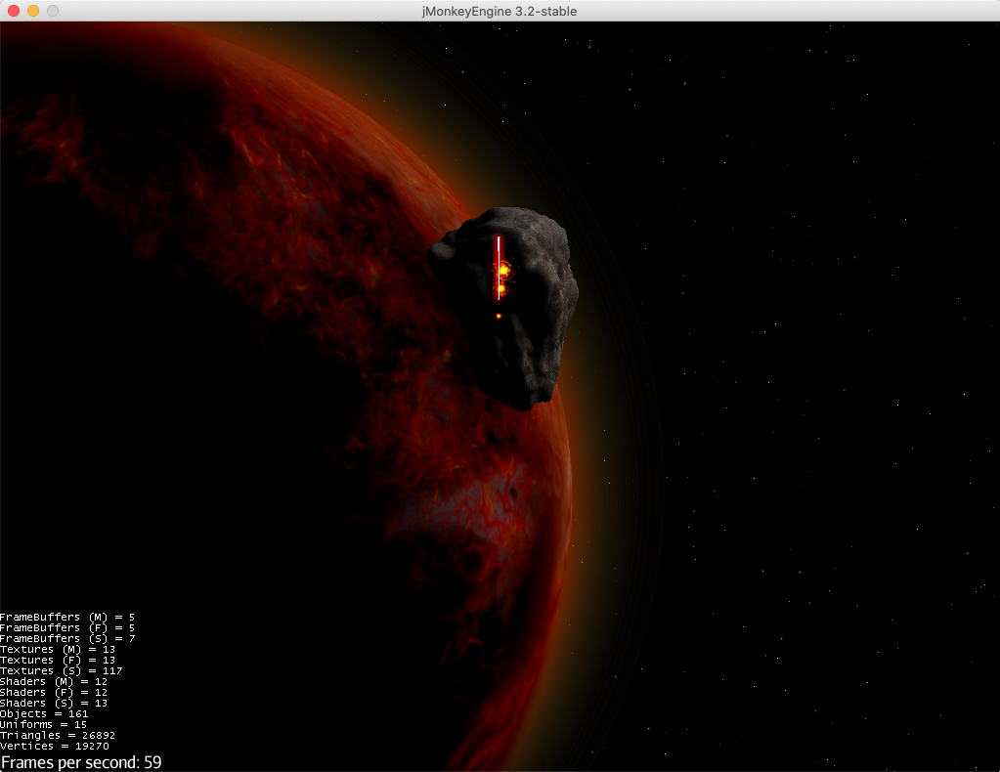

# Description
A small lasershooter game as playground to explore possibilities of 3D in Java with jMonkeEngine.

###### Following features of the game engine have been applied so far
* loading external models created with blender
* filters / post processors for glow effects
* particle emitters for animated explosion effect
* audio nodes for laser beam and explosions
* simple collision detection (no bulletphysics yet)

## External Ressources
### Meshes
* created with https://www.blender.org

### Textures
* see http://texturelib.com

#### Explosion Images
* created by /sinestesiastudio (facebook) or /sinestesiaguy/ (Instagram)
* https://opengameart.org/content/2d-explosion-animations-frame-by-frame

#### Planet Sprites
* created by Viktor.Hahn@web.de
* https://opengameart.org/content/16-planet-sprites

### Sounds
#### Laser
* created with https://www.bfxr.net

#### Explosion
* https://www.freesoundeffects.com/free-sounds/explosion-10070/

## Further Documentation

### jMonkey
- Homepage: https://jmonkeyengine.org
- Documentation: https://wiki.jmonkeyengine.org/#create
- Examples: https://github.com/jMonkeyEngine/jmonkeyengine/tree/master/jme3-examples/src/main/java/jme3test
- Dependencies: https://jcenter.bintray.com/org/jmonkeyengine/
